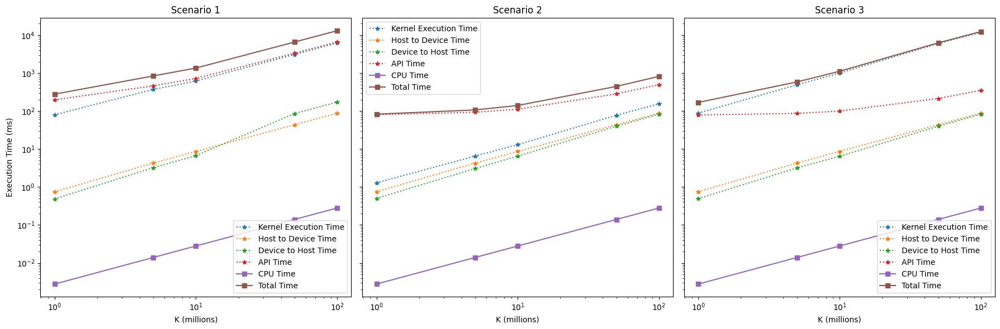
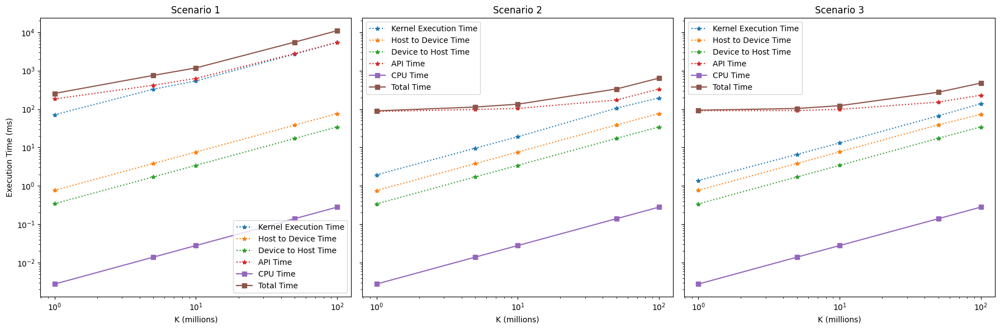

# CUDA Unified Memory

## Introduction
This project explores the utilization of CUDA Unified Memory to perform vector addition operations on both host (CPU) and GPU. It aims to quantify the speed-up of operations using different memory management strategies and analyze how CUDA's unified memory impacts performance.

## Project Structure
This project contains several key components:
- **C++ Programs:** Perform vector addition on the CPU.
- **CUDA Kernels:** Execute vector addition on the GPU using various configurations of blocks and threads.
- **Comparative Analysis:** Between operations using standard memory allocation and CUDA Unified Memory.

## Methodology
The tasks are divided as follows:
1. **Vector Addition on CPU:**
   - Implement and profile a C++ program that adds two large arrays. `CPUVecAdd`
2. **Vector Addition on GPU without Unified Memory:**
   - Implement the addition using traditional `cudaMalloc()` and `cudaMemcpy()` for memory management. `GPUVecAdd`
3. **Vector Addition on GPU with Unified Memory:**
   - Utilize `cudaMallocManaged()` to handle memory which simplifies data handling between CPU and GPU. `GPUVecAddUM`

## Results and Observations
### Execution Time and Performance Analysis
- **Vector Addition on CPU:**
  - Linear increase in execution time with the size of K, demonstrating the CPU’s efficiency in handling array operations up to a certain scale.
- **GPU without Unified Memory:**
  - Performance varies significantly across different scenarios:
    - Single thread: Poor performance due to limited parallelism.
    - 256 threads in one block: Moderate improvements.
    - Multiple blocks with 256 threads each: Best performance, fully utilizing GPU capabilities.



- **GPU with Unified Memory:**
  - Generally slower than non-unified scenarios due to overhead from automatic data migration.
  - Maintains better consistency across different computational loads.
  


## Installation and Setup
Ensure you have the NVIDIA CUDA Toolkit installed and configured correctly. The code is compatible with CUDA version 10.0 or higher.

## How to Run
Navigate to the project directory and use the provided batch scripts for each task:
```bash
bash batchscript_CPUVecAdd.sh # For CPU vector addition
bash batchscript_GPUVecAdd.sh # For GPU without unified memory
bash batchscript_GPUVecAddUM.sh # For GPU with unified memory
```

## Resources
I referred the following blog post for additional information!
[An Even Easier Introduction to CUDA](https://developer.nvidia.com/blog/even-easier-introduction-cuda/)

## Conclusion
This project highlights the trade-offs between ease of programming with CUDA Unified Memory and achieving optimal performance. It underscores the importance of aligning memory management techniques with the computational workload and GPU architecture to maximize performance.
